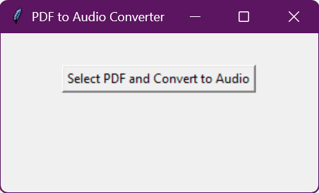
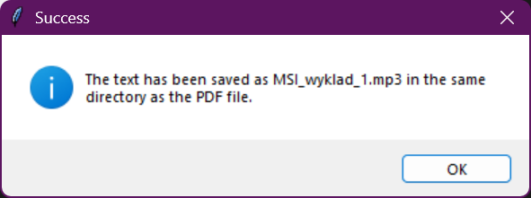

# PDF-to-Audio-exe

PDF-to-Audio-exe is a Python-based application designed to convert text from PDF files into MP3 audio files using text-to-speech (TTS) synthesis. This application can be used to listen to your PDFs, whether they are books, documents, or articles, by converting them into audio format. The project uses the PyPDF2 library for handling PDF files and pyttsx3 for offline TTS conversion. It’s packaged as a standalone executable with PyInstaller for ease of use.

<div align="center">
    
    
</div>

## Features
- Convert any PDF file to audio in MP3 format.

## Requirements
- Python 3.x
- PyPDF2
- pyttsx3

## Installation
Clone this repository:

   ```bash
   git clone https://github.com/yourusername/PDF-to-Audio-exe.git
   cd PDF-to-Audio-exe
   ```

## Usage
Place the PDF file you want to convert in the same directory as the executable.

Run the executable:

```bash
./PDF-to-Audio.exe
```
